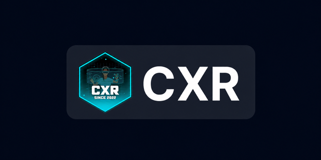

<div align="center">
  
  <p><small><i>Icon will be provided</i></small></p>
  
  ### Local LAN-based file sharing and management system for labs and campuses

[](https://github.com/ToTheBlankWorld/-CXR-Lab-File-System/releases)
[](https://github.com/ToTheBlankWorld/-CXR-Lab-File-System/commits/main)
[](https://github.com/ToTheBlankWorld/-CXR-Lab-File-System/stargazers)

</div>

CXR-Lab File System is a local LAN-based file sharing and management system designed for labs and campuses. Built with Next.js and backed by SFTP storage, it offers fast file uploads with folder tree selection, URL shortening, role-based access control, and an admin dashboard.

## ✨ Features

- 📂 **Folder Tree Upload** — Select a folder with all subfolders and files; the exact tree structure is preserved on the server
- ⚡ **Ultra-Fast Uploads** — Single persistent SFTP connection eliminates SSH handshake overhead; parallel uploads (5 concurrent workers)
- 👥 **Role-Based Access** — Admin can manage all files and users; regular users can only delete their own uploads
- 🔗 **URL Shortener** — Create short URLs for quick sharing
- 🖼️ **Universal Preview** — Preview images, videos, PDFs, and code with syntax highlighting
- 🔍 **File Browser** — Browse, search, sort, and filter files on the SFTP server
- 📊 **Admin Dashboard** — User management with file/URL content inspection, role assignment, and user deletion
- 🎨 **Modern UI** — Clean interface built with shadcn/ui and Next.js 15

## 🚀 Quick Start

### Prerequisites

- Node.js 18+
- PostgreSQL database
- SFTP server

### Setup

1. Clone the repo and install dependencies:

   ```bash
   git clone https://github.com/ToTheBlankWorld/-CXR-Lab-File-System.git
   cd CXR-Lab-File-System
   npm install
   ```

2. Copy `.env.example` to `.env` and fill in your configuration:

   ```bash
   cp .env.example .env
   ```

   Required environment variables:
   - `DATABASE_URL` — PostgreSQL connection string
   - `SFTP_HOST`, `SFTP_PORT`, `SFTP_USERNAME`, `SFTP_PASSWORD` — SFTP server credentials
   - `NEXTAUTH_SECRET` — Authentication secret
   - `NEXTAUTH_URL` — Public URL of your instance

3. Apply database migrations:

   ```bash
   npx prisma migrate deploy
   ```

4. Build and start:

   ```bash
   npm run build
   npm start
   ```

5. Open `http://localhost:3000` to complete setup and create your admin account.

## 📁 Folder Upload Behavior

When you select a folder for upload, the **entire folder** (including the folder itself) is uploaded preserving the exact tree structure:

```
Local: testBuild2Phase1/
  CXR_Backend.exe
  CXR_Backend_Data/
    ...

On server: targetPath/testBuild2Phase1/
  CXR_Backend.exe
  CXR_Backend_Data/
    ...
```

## 🔒 Permission Model

| Action | Admin | Regular User |
|--------|-------|-------------|
| Upload files | ✓ | ✓ (quota enforced) |
| Delete own files | ✓ | ✓ |
| Delete other's files | ✓ | ✗ |
| Delete any folder | ✓ | ✗ (must own all files inside) |
| Manage users | ✓ | ✗ |
| View all content | ✓ | Own only |

File ownership is tracked in the database. Files uploaded before this tracking was added can only be deleted by admins.

## 💬 Support

Need help? Join the [Discord](https://discord.gg/mwVAjKwPus) for support, discussions, and updates!

## 📜 License

MIT License
